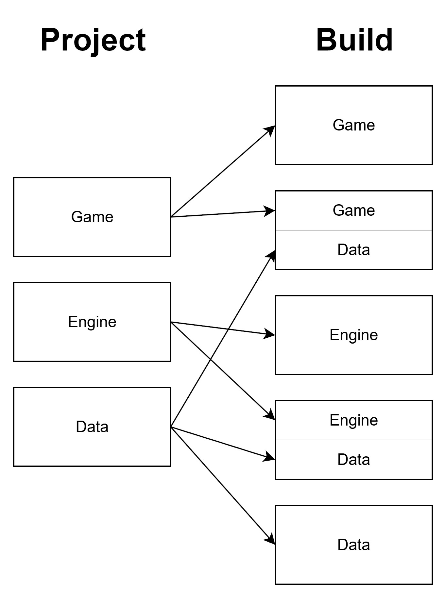

The Z80 has a 16-bit address bus, which means it can only access 64KB of memory at once. On the Spectrum Next, that space is split into eight 8KB banks that you can swap in and out as needed,  kind of like changing disks in a drive, but much faster. By mapping different pages of memory into those banks, I can control which parts of the game are active depending on what’s happening.

My project’s architecture is built around three big blocks:

- Data (the assets and state)
- Engine (the core systems)
- Game (the actual logic and content)

Each block takes up one or more memory pages. That setup worked perfectly for a while, until I hit the wall. My core engine, all packed into a single 8KB page, finally ran out of space.

I knew it was coming. I’d already split the scene renderer and audio player into separate pages, but the main engine — physics, rendering, animation — was still all in one place. So, time to rethink.

My first idea was to break the engine into multiple pages, grouping things by function: physics on one, rendering on another, collision on a third. It sounded tidy in theory… but in practice, it got messy fast.

Some systems needed both the core engine and a feature page loaded at once, which meant juggling multiple banks just to get basic things running. My mapping logic was starting to look like spaghetti.

Then, during one of my test runs, something clicked. The issue wasn’t really about code size,  it was about the relationship between data and code. The core engine functions always needed to work with their data at the same time. If they lived on different pages, I was wasting banks just to keep them both accessible.

So I flipped the approach: instead of separating data and engine code, I brought them together. Each type of data (like entities) now lives in the same page as the functions that operate on it. When a page is active, everything it needs is already there , no extra mapping, no juggling banks.

After reorganizing things this way, everything just clicked. The system ran smoother, and I even freed up around 2KB in the core engine page. That may not sound like much, but on an 8-bit machine, that’s like finding hidden treasure.

But to make this work, I had to rethink how my whole project was structured. Originally, everything was organized into those three main blocks — data, engine, and game — and that structure still makes sense. It keeps things logically separated and easier to maintain.

The solution wasn’t to abandon that structure, but to add a new build layer on top of it. This build system takes pieces from each block and organizes them according to the needs of a specific build. That way, I still keep my core architecture clean and modular, but I also gain the flexibility to assemble memory pages differently depending on the build requirements.

In the end, this approach gave me the best of both worlds: a well-structured project that’s easy to maintain, and a flexible build process that can adapt to different memory layouts or even alternative build schemas in the future.

---

Every pixel, every system, and every line of code in dot8 brings me closer to capturing that perfect retro feeling — precise, responsive, and alive. What about you — how would you design your ideal retro engine?
