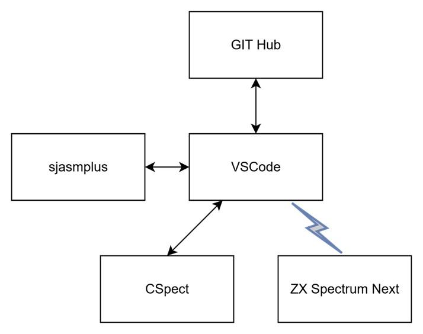

My development environment is based on windows desktop using VSCode as editor with a collections of extension and CSpect for ZX Spectrum Next Emulation and also ZX Spectrum Next hardware.

## Tools ##
**Visual Studio Code (VS Code)** is a lightweight, open-source, and highly extensible code editor from Microsoft that supports multiple programming languages, debugging, Git integration, and a rich ecosystem of extensions for efficient development.

 [https://code.visualstudio.com/download](https://code.visualstudio.com/download)

 ---
 
 **sjasmplus** is a powerful Z80 assembler that provides advanced features and flexibility for Spectrum Next development.

[https://github.com/z00m128/sjasmplus](https://github.com/z00m128/sjasmplus)

---

**CSpect** is a Spectrum Next emulator that delivers near full hardware accuracy, allowing software to run almost exactly as it would on the real machine.

[https://mdf200.itch.io/cspect](https://mdf200.itch.io/cspect)

---

For more information about this theme, check the documentation: https://stack.jimmycai.com/

Want a site like this? Check out [hugo-theme-stack-stater](https://github.com/CaiJimmy/hugo-theme-stack-starter)

> Photo by [Pawel Czerwinski](https://unsplash.com/@pawel_czerwinski) on [Unsplash](https://unsplash.com/)