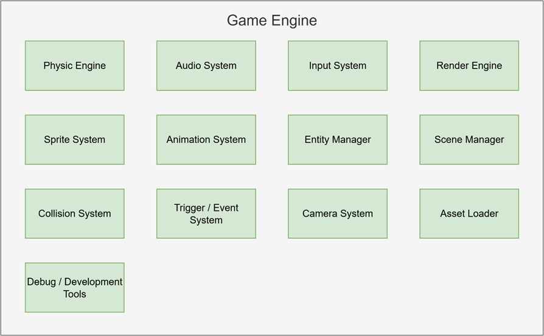

The dot8 retro game engine is composed of distinct subsystems, each designed with a clear role in mind to ensure smooth collaboration and maintainability. By assigning dedicated responsibilities—such as rendering graphics, processing user input, or managing audio—these modular components interact harmoniously while remaining independent in their logic and operation. This separation not only streamlines development and debugging but also allows for flexibility in updating or swapping out features without disrupting the whole system. The result is an engine where each piece does its job efficiently, contributing to a cohesive and robust framework for building classic gaming experiences.

## Physic Engine ##

The physics engine handles how objects move and react to forces like velocity and gravity. It updates positions each frame and supports basic dynamics for things like jumping or falling, while keeping performance in mind for 8-bit hardware.

## Audio System ##

The audio system plays music and sound effects using PT3 files. It can trigger sounds from gameplay events and supports music playback that runs independently of the main game loop, giving life to the game world.

## Input System ##

The input system reads controls from the keyboard or joystick and translates them into game actions. It supports responsive input handling for player movement, menu navigation, or interactive gameplay triggers.

## Render Engine ##

The render engine draws all visible objects to the screen based on their position and sprite. It ensures correct layering and only draws what's necessary, keeping the frame rate smooth and the visuals crisp.

## Sprite System ##

The sprite system manages visual tiles and frame data used to display characters, enemies, and effects. It pulls graphics from sprite sheets and handles flipping or offsetting for clean and flexible rendering.

## Animation System ##

This system controls how sprites animate over time. It changes frames based on timing and states, allowing characters to walk, jump, or attack smoothly. It also supports keyframe-based events during animations.

## Entity Manager ##

The entity manager keeps track of all game objects. It handles creating, updating, and removing objects efficiently during gameplay and ensures each object is correctly processed in the game loop.

## Scene Manager ##

The scene manager loads and switches between different levels or screens. It resets objects, positions the camera, and prepares the environment when moving between gameplay, menus, or cutscenes

## Collision System ##

The collision system checks for overlaps between objects, like when the player hits a wall or enemy. It uses simple box checks (AABB) and helps the game react to hits, blocks, or pickups instantly.

## Trigger / Event System ##

This system manages special zones or timed actions. When the player steps on a trigger or a timer finishes, it fires an event—like opening a door, playing a sound, or switching animation state.

## Camera System ##

The camera system follows the player or focuses on key areas of the scene. It ensures that only part of the world is visible on screen, adding cinematic control and smooth scrolling to the game.

## Asset Loader ##

The asset loader handles loading sprites, music, level data, and configuration from memory or external files. It prepares everything needed before the game starts or when switching scenes.

## Debug Tools ##

The debug tools provide visibility into what’s happening inside the engine. They can show object positions, active collisions, memory usage, or FPS counters on screen. These tools help test levels, tune performance, and catch bugs quickly—especially useful during development on limited hardware like the Spectrum Next.

---

As I bring all these systems together, I’m turning the dot8 retro game engine into my creative playground right now. Whether I’m debugging, exploring, or building brand new worlds, the engine lets me bring my ideas to life with excitement and ease. I’m proving that with smart design and a passion for games, even the simplest tools can make something truly fun—right here, in this very moment!