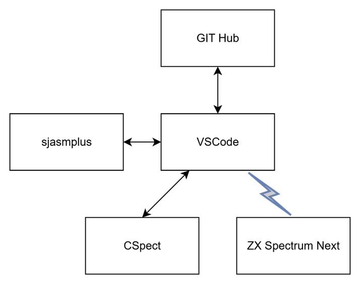

My development environment is based on windows desktop using VSCode as editor with a collections of extension and CSpect for ZX Spectrum Next Emulation and also ZX Spectrum Next hardware.

## Tools ##

**Visual Studio Code (VS Code)** is a lightweight, open-source, and highly extensible code editor from Microsoft that supports multiple programming languages, debugging, Git integration, and a rich ecosystem of extensions for efficient development.

 [https://code.visualstudio.com/download](https://code.visualstudio.com/download)

 ---

 **sjasmplus** is a powerful Z80 assembler that provides advanced features and flexibility for Spectrum Next development.

[https://github.com/z00m128/sjasmplus](https://github.com/z00m128/sjasmplus)

---

**CSpect** is a Spectrum Next emulator that delivers near full hardware accuracy, allowing software to run almost exactly as it would on the real machine.

[https://mdf200.itch.io/cspect](https://mdf200.itch.io/cspect)

---

**GitHub** is a platform for hosting and collaborating on code projects, enabling version control and teamwork through Git in the cloud.

[https://github.com/](https://github.com/)

---

The **ZX Spectrum Next** is a modern reimagining of the classic ZX Spectrum, offering enhanced hardware while staying true to the original’s spirit.

[https://www.specnext.com/](https://www.specnext.com/)

---

**Hardware remote debug Remote** debugging from real hardware is possible by connecting the ZX Spectrum Next joystick port to your PC via USB.

[6 Pin FTDI FT232RL USB To Serial Adapter módulo USB TO TTL RS232 cabo](https://www.amazon.es/-/pt/dp/B07LH95J24/ref=sr_1_2?crid=HSHSJ9CA7249&dib=eyJ2IjoiMSJ9.H2BTHlbtWYfLfNArbbhQroLZCqfoI7oux5ocaU7n9rcAlC3sCrMTz0vHL07LuAE4L72wNA9C11wxCg91MTZJsUDNNKzjlC4J99_zfO6JobPzPYyzZFtvCf8W9StuiN7-jo34oEvN1_Eufq6wMj6j7DfhXexiKsoVj2ahs7HEIIvrfsKMeTXtTFJWm2eIelB3BS4Cdna8WDzVPd7IAauclGdGXdqjtieaBjKvvxqz1zbZM2SHdKMXmKXOS6FqonOodlwqiudBe9ZWL6CddIhdIRiH7aA2xbfzL9iB-vr-Sgs.G2ulRaKX4CxV3tMt7OXhfnqcd59YwsDFoZIKz5yAg4U&dib_tag=se&keywords=6+Pin+FTDI+FT232RL+USB+To+Serial+Adapter+m%C3%B3dulo+USB+TO+TTL+RS232+cabo&qid=1756330702&s=electronics&sprefix=6+pin+ftdi+ft232rl+usb+to+serial+adapter+m%C3%B3dulo+usb+to+ttl+rs232+cabo%2Celectronics%2C223&sr=1-2)

---

## VSCode Extensions ##

VSCode is the beating heart of my coding world, supercharged by countless plugins that make every development task smoother and more powerful.

I supercharge VSCode with a curated set of extensions that elevate Z80 assembly development to the same power and convenience as modern languages like C.

**ASM Code Lens** A language server that enables code lens, references, hover information, symbol renaming and the outline view for assembler files.

[https://marketplace.visualstudio.com/items?itemName=maziac.asm-code-lens](https://marketplace.visualstudio.com/items?itemName=maziac.asm-code-lens)

---

**DeZog** is a powerful Z80 debugger plugin for VSCode, offering advanced tools to make Spectrum Next development efficient and precise.

My favourite extension makes debugging easier and more powerful than ever—it’s like a Swiss Army knife for developers.

[https://marketplace.visualstudio.com/items?itemName=maziac.dezog](https://marketplace.visualstudio.com/items?itemName=maziac.dezog)

---

**NEX-FileViewer** adds a readonly file viewer for ZX Spectrum NEX files. .nex is a special file format for loading ZX Next programs. The viewer shows registers, a memory dump and the included screen images.

[https://marketplace.visualstudio.com/items?itemName=maziac.nex-fileviewer](https://marketplace.visualstudio.com/items?itemName=maziac.nex-fileviewer)

---

**Z80 Assembly meters** meters clock cycles and bytecode size from Z80 assembly source code.

Forget the T-state cheat sheet, instantly see instruction cycles and byte sizes as you code.

[https://marketplace.visualstudio.com/items?itemName=theNestruo.z80-asm-meter](https://marketplace.visualstudio.com/items?itemName=theNestruo.z80-asm-meter)

---

**Z80 Instruction Set** Provides documentation of the Z80 instructions on hovering.

[https://marketplace.visualstudio.com/items?itemName=maziac.z80-instruction-set](https://marketplace.visualstudio.com/items?itemName=maziac.z80-instruction-set)

---

**Todo** Tree Show TODO, FIXME, etc. comment tags in a tree view

[https://marketplace.visualstudio.com/items?itemName=Gruntfuggly.todo-tree](https://marketplace.visualstudio.com/items?itemName=Gruntfuggly.todo-tree)

---

## Resources ##

There’s a massive amount of information out there, you just need to know where to look. Here’s my curated list of the essentials.

- [https://www.specnext.com/](https://www.specnext.com/)
- Spectrum Next discord server
- [https://luckyredfish.com/](https://luckyredfish.com/)
- [https://zx.remysharp.com/](https://zx.remysharp.com/)
- [Jim Bagley tutorials](https://www.youtube.com/watch?v=Nphrf14ZRpI&list=PLK49nPX3nslseUVUj_ZYk7YL95-v4LlLY)
- [https://www.assemblytutorial.com/](https://www.assemblytutorial.com/)
- [http://z80-heaven.wikidot.com/math](http://z80-heaven.wikidot.com/math)
- [https://www.patreon.com/c/u27217558/home](https://www.patreon.com/c/u27217558/home)
- [https://www.patreon.com/c/mikedailly/posts](https://www.patreon.com/c/mikedailly/posts)

---

These are the tools and resources that power my development workflow, but they’re by no means the only options out there. The Spectrum Next community is full of amazing alternatives, so explore, experiment, and find the setup that works best for you.
