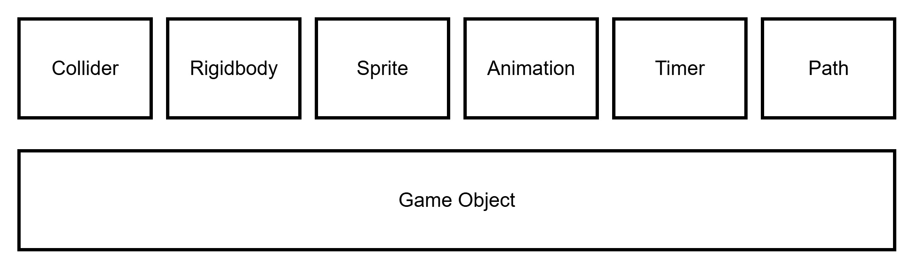

In the engine, entities materialized as game objects, which serve as containers for all relevant data and behaviour. Each game object typically holds references to components such as sprite, physics body, collider, and logic scripts. This modular design allows flexibility in defining varied entities—like players, enemies, items, or triggers—by composing them from shared building blocks.

## Game object properties ##

### Id ###

Is a distinct, engine-assigned identifier given to each game object at creation time. It ensures that every object can be individually referenced, tracked, or compared, even if multiple objects share the same type, tag, or position.

### Tag ###

A short identifier string or byte value that describes the object’s logical category (e.g., "enemy", "bullet", "checkpoint"). Tags are used to group or filter game objects during logic checks, such as collision response or trigger activation. Unlike class types, tags are flexible and can be changed at runtime.

### Flags ###

Is a bitfield property that stores multiple binary (on/off) attributes for a game object using a single byte or word. Each bit in the flags value represents a specific toggleable property or state, such as enabled, or don’t destroy.

### Parent ###

is a reference to another game object that acts as the logical or spatial parent of this object. It links a child object to its parent, allowing it to inherit position, state, or behaviour hierarchically.

### X ###

Represents the object's horizontal position within the scene or world coordinate system. It defines how far the object is placed from the left edge of the scene, measured in pixels.

### Y ###

Represents the object's vertical position within the scene or world coordinate system. It defines how far the object is placed from the top edge of the scene, measured in pixels.

### FSM ###

A Finite State Machine (FSM) is a way to control behaviour by dividing it into a fixed number of states, where each state defines what the object is doing. At any moment, the object is in one state, and it can switch to another based on conditions or events.

### FSM State ###

is a value that represents the current behaviour or mode of a game object within a finite state machine (FSM). Each value corresponds to a specific state, such as idle, walking, jumping, or attacking.

### Collider ###

The collider component defines the physical size and collision behaviour of a game object. It can be assigned to both rigid and non-rigid entities. The collider does not handle physics simulation itself (e.g. gravity or forces) but acts as a collision shape and provides hooks for event responses when overlapping or contacting other objects.

### Rigidbody ###

The Rigidbody component controls how a game object moves over time based on velocity, applied forces, and optionally gravity. It defines dynamic motion separate from collision boundaries, allowing for smooth, physically influenced movement like falling, sliding, or being pushed.

### Sprite ###

The Sprite component defines how a game object is visually rendered on screen. It contains information about the sprite’s size, position offset, which spritesheet to use, and the current frame to display from the spritesheet.

### Animation ###

The Animation component manages how a game object’s sprite is animated over time. It tracks the current animation state, controls the frame rate, steps through keyframes, and handles event triggers tied to specific frames. It also includes a small finite state machine (FSM) to manage transitions between different animations (e.g., idle, walk, jump, attack).

### Timer ###

The Timer component is used to trigger events after a specified number of frames. It can be configured to fire once or loop continuously, making it ideal for timed effects, delays, cooldowns, or periodic actions.

### Path ###

The Path component moves a game object along a predefined series of points, creating automated. It supports a custom speed, directional travel, and options to run once, loop, or ping-pong back and forth.

```

 struct	Object
ID			    db	0	
Tag			    db	0	
Flags			db	0	
PosX			dw	0	
PosY			dw	0	
Parent			db	0	
State			db	0	
FSM			    dw	0	
SpriteComp		db	0	
PhysicComp		db	0	
AnimationComp	db	0	
ColliderComp	db	0	
PathComp		db	0	
TimerComp		db	0	
	ends

```

The **Object** structure holds all the key data for each entity in the game. It is stored as a fixed-size block in memory, making it easy and fast to access in assembly. This simple layout helps the engine update and draw many objects efficiently, while keeping the code clean and organized.

---

As I continue building the dot8 engine, I constantly find myself relying on the Entity Manager it’s really the heartbeat of everything. Right now, it’s the system that keeps track of all active objects in the scene, from enemies and bullets to triggers and NPCs. It decides which entities get updated, drawn, or removed each frame. Without it, the game world would fall apart. It’s not flashy, but it quietly orchestrates the entire flow of gameplay, ensuring every component knows where it belongs. And as the engine grows, the Entity Manager keeps proving itself as the glue that holds all the pieces together.